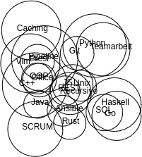

## Physic like bubble movement

Bubbles with different radius are starting all at the same point (middle of canvas). With every new iteration, they moving away from each other till there is no overlapping anymore.

The bubbles contain strings. Every bubble has its own button. A bubble increases if the button is pressed and the movement to avoid overlapping starts again.

It's for visualization data with user interaction.

## Final example

## Step by step movement

